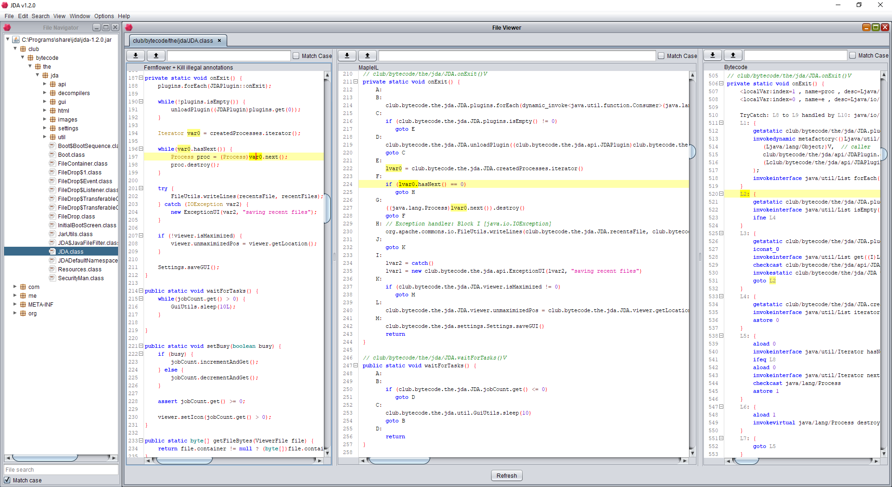

# JDA - The Java Disassembler


Tired of seeing this???

```java
// $FF: Couldn't be decompiled
```

The Java Disassembler (JDA) is a GUI reverse engineering tool that can turn this:

```java
// $FF: Couldn't be decompiled
// java.lang.IllegalArgumentException: Invalid type: @
//     at org.jetbrains.java.decompiler.struct.gen.VarType.getType(VarType.java:405)
//     at org.jetbrains.java.decompiler.struct.gen.VarType.<init>(VarType.java:90)
//     at org.jetbrains.java.decompiler.struct.gen.VarType.<init>(VarType.java:62)
// ...
```

into this:

```java
public void keyPressed(KeyEvent var1) {
    super.keyPressed(var1);
    int var10000 = var1.getKeyCode();
    int var10001 = (3 << 2 & 9 | 5 | 7) ^ 5;
    int var10003 = 0 ^ 1165448477 ^ 958591453 ^ 2085987521;
    if (var10000 == var10001) {
        11.iiIIiiiiIiIIi(this.IIiiIiiiIIiiI, this.IiIIiiiiiiiiI, this.IIiiiiiiIIiIi);
    }
}
```

and finally this:

```java
public void keyPressed(KeyEvent var1) {
    super.keyPressed(var1);
    if (var1.getKeyCode() == 10) {
        11.iiIIiiiiIiIIi(this.IIiiIiiiIIiiI, this.IiIIiiiiiiiiI, this.IIiiiiiiIIiIi);
    }
}
```

## Features
JDA offers powerful static analysis tools, such as control and data flow analysis, and code simplification
built using a custom IL. Moreover, many tasks expected of a disassembler such as constant and string searching are available.
These standard core utilities are with the [MapleIR](https://github.com/LLVM-but-worse/maple-ir) plugin. You
can also access the IL API and integrate into the UI by writing your own plugins in Java.
In the near future it will support whole binary cross referencing (xrefs) and more.

 - Ergonomic design for high-level browsing or low-level bytecode reversing
 - [Data-flow analysis with copy and constant propagation](docs/propagation-analysis.png) (provided by MapleIR)
 - Support for a variety of decompilers
 - Side-by-side view of decompilation, bytecode, and IL.



## Motivation
Due to the growing power and complexity of commercial obfuscation programs for Java, it has become
necessary to develop improved reverse engineering and static analysis tools. JDA was developed to
provide professional-quality static analysis tools for JVM-based languages.

JDA began as a fork of Bytecode Viewer (BCV). BCV suffered heavily from bloat, poor performance, and
stagnant development. In JDA many useless or irrelevant features have been removed, and significant parts
of the codebase have been cleaned up or rewritten entirely.

## Scope
With that in mind, JDA's goal is to be a focused, light-weight yet powerful Java static disassembler.
JDA's role is to provide a platform and interface for the core features such as analysis and disassembly.
Therefore, JDA's scope is to be a platform for Java reverse engineering tools to be built on top of.

More to come in the future.

## MapleIR Plugin

To install the plugin put the plugin jar in `~/.jda/plugins` (or equivalently, `%USERPROFILE%\.jda\plugins` on Windows), then restart.

## Compiling
See [COMPILING.md](./docs/COMPILING.md) for compilation instructions.

## Credits
 - Logo (icosahedron) image by [Brayden Gregerson](http://braydengregerson.com), used with permission
 - [Bytecode Viewer](https://github.com/Konloch/bytecode-viewer) by [Konloch](https://github.com/Konloch)
 - Disassembler by [Bibl](https://github.com/TheBiblMan)
